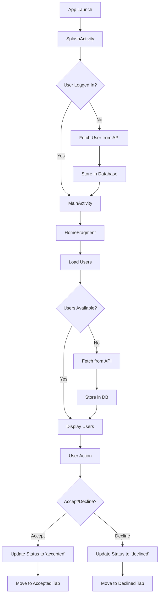

# Match Mate - Android Dating App 💕


A modern Android dating application built with Kotlin that allows users to discover potential matches, accept or decline them, and manage their preferences. The app follows clean architecture principles and modern Android development practices.

## 📱 Features

- **User Discovery**: Browse through potential matches fetched from external API
- **Match Management**: Accept or decline potential matches
- **Organized Tabs**: View accepted and declined matches separately
- **Match Scoring**: Intelligent match score calculation based on age and location
- **Offline Support**: Local database caching for seamless user experience
- **Modern UI**: Material Design components with clean interface
- **Pagination**: Efficient loading of user data with scroll-based pagination

## 🏗️ Architecture

The app follows **MVVM (Model-View-ViewModel)** architecture pattern with **Repository pattern** for clean separation of concerns:

```
┌─────────────────┐    ┌─────────────────┐    ┌─────────────────┐
│   UI Layer      │    │  Domain Layer   │    │   Data Layer    │
│                 │    │                 │    │                 │
│ • Activities    │◄──►│ • ViewModels    │◄──►│ • Repository    │
│ • Fragments     │    │ • LiveData      │    │ • API Service   │
│ • Adapters      │    │ • Use Cases     │    │ • Local DB      │
└─────────────────┘    └─────────────────┘    └─────────────────┘
```

### Architecture Components

#### 🎯 **Presentation Layer (UI)**
- **Activities**: Entry points for user interaction
  - `SplashActivity`: Initial loading and user authentication
  - `MainActivity`: Main container with bottom navigation
- **Fragments**: Modular UI components
  - `HomeFragment`: Displays potential matches
  - `AcceptedFragment`: Shows accepted matches
  - `DeclinedFragment`: Shows declined matches
- **Adapters**: 
  - `HomeAdapter`: RecyclerView adapter for user cards

#### 🧠 **Domain Layer (Business Logic)**
- **ViewModels**: UI-related data holders surviving configuration changes
  - `SplashViewModel`: Handles user login state
  - `HomeViewModel`: Manages match discovery and user actions
  - `AcceptedViewModel`: Manages accepted users data
  - `DeclinedViewModel`: Manages declined users data
- **Use Cases**: Encapsulated business logic through repository

#### 💾 **Data Layer**
- **Repository Pattern**: Single source of truth for data
  - `UserRepository`: Coordinates between API and local database
- **API Service**: Network data source
  - `MatchMateApi`: Retrofit interface for API calls
  - `RetrofitInstance`: Singleton Retrofit configuration
- **Local Database**: Room database for offline support
  - `AppDatabase`: Room database configuration
  - `UserDao`: Data Access Object for user operations

## 🎨 Design Patterns

### 1. **Repository Pattern**
```kotlin
class UserRepository {
    private val apiService = RetrofitInstance.apiService
    private val userDao = DatabaseManager.getDatabase().userDao()
    
    suspend fun fetchUsers(): ApiResult<List<User>> {
        // Coordinates between API and local database
    }
}
```
**Benefits**: Centralized data access, easier testing, separation of concerns

### 2. **Observer Pattern**
```kotlin
// ViewModel exposes LiveData
val users: LiveData<ApiResult<List<User>>> = _users

// Fragment observes changes
viewModel.users.observe(viewLifecycleOwner) { result ->
    when (result) {
        is ApiResult.Success -> updateUI(result.data)
        is ApiResult.Error -> showError(result.message)
        ApiResult.Loading -> showLoading()
    }
}
```
**Benefits**: Reactive UI updates, lifecycle-aware components

### 3. **Singleton Pattern**
```kotlin
object DatabaseManager {
    @Volatile
    private var INSTANCE: AppDatabase? = null
    
    fun getDatabase(): AppDatabase {
        return INSTANCE ?: throw IllegalStateException("Database not initialized")
    }
}
```
**Benefits**: Single database instance, memory efficiency

### 4. **Factory Pattern (Implicit)**
- Room database creation
- Retrofit service creation
- ViewModel instantiation through ViewModelProvider

### 5. **State Pattern**
```kotlin
sealed class ApiResult<out T> {
    data class Success<T>(val data: T) : ApiResult<T>()
    data class Error(val code: Int? = null, val message: String? = null) : ApiResult<Nothing>()
    data object Loading : ApiResult<Nothing>()
}
```
**Benefits**: Type-safe state management, exhaustive when expressions

## 🛠️ Technical Implementation

### Dependency Management
The app uses **Version Catalog** (`libs.versions.toml`) for centralized dependency management:
```toml
[versions]
kotlin = "1.9.23"
retrofit = "2.9.0"
room = "2.6.0"
lifecycle = "2.7.0"

[libraries]
retrofit = { module = "com.squareup.retrofit2:retrofit", version.ref = "retrofit" }
room-runtime = { module = "androidx.room:room-runtime", version.ref = "roomRuntime" }
```

### Key Technologies

#### 🌐 **Networking**
- **Retrofit 2.9.0**: HTTP client for API communication
- **Gson Converter**: JSON serialization/deserialization
- **OkHttp**: HTTP client with interceptors support

#### 💾 **Local Database**
- **Room 2.6.0**: SQLite abstraction layer
- **Entity**: `@Entity` annotation for database tables
- **DAO**: Data Access Objects for database operations
- **Database**: `@Database` annotation for database configuration

#### 🎭 **UI Components**
- **Material Design Components**: Modern Android UI
- **ViewBinding**: Type-safe view references
- **RecyclerView**: Efficient list display
- **Bottom Navigation**: Tab-based navigation
- **Fragments**: Modular UI components

#### 🖼️ **Image Loading**
- **Glide 4.16.0**: Efficient image loading and caching
- **Placeholder support**: Loading and error states
- **Memory optimization**: Automatic bitmap recycling

#### ⚡ **Asynchronous Programming**
- **Kotlin Coroutines**: Structured concurrency
- **Suspend functions**: Non-blocking operations
- **Dispatchers**: Context switching for different tasks
- **ViewModelScope**: Lifecycle-aware coroutine scope

### Application Flow



## 📊 Data Flow

### User Data Pipeline
1. **API Source**: RandomUser.me API provides user data
2. **Data Transformation**: JSON response parsed to `User` entity
3. **Local Storage**: Data cached in Room database
4. **UI Presentation**: Data displayed through ViewModels and LiveData

### State Management
```kotlin
// ViewModel manages UI state
private val _users = MutableLiveData<ApiResult<List<User>>>()
val users: LiveData<ApiResult<List<User>>> = _users

// Repository provides data
suspend fun fetchUsers(): ApiResult<List<User>> {
    return try {
        val response = apiService.fetchUsers()
        if (response.isSuccessful) {
            val userList = parseResponse(response.body())
            userDao.insertUsers(userList)
            ApiResult.Success(userList)
        } else {
            ApiResult.Error(response.code(), response.message())
        }
    } catch (e: Exception) {
        ApiResult.Error(e.hashCode(), e.message)
    }
}
```

## 🔧 Core Components

### 1. Data Models
```kotlin
@Entity(tableName = "users")
data class User(
    @PrimaryKey val uuid: String,
    val nameFirst: String,
    val nameLast: String,
    val email: String,
    val dobAge: Int,
    val locationCity: String,
    val locationCountry: String,
    val pictureLarge: String,
    val education: String,
    val religion: String,
    val status: String = "pending" // pending, accepted, declined, self
)
```

### 2. Database Schema
```sql
CREATE TABLE users (
    uuid TEXT PRIMARY KEY NOT NULL,
    gender TEXT NOT NULL,
    nameFirst TEXT NOT NULL,
    nameLast TEXT NOT NULL,
    email TEXT NOT NULL,
    dobAge INTEGER NOT NULL,
    locationCity TEXT NOT NULL,
    locationCountry TEXT NOT NULL,
    pictureLarge TEXT NOT NULL,
    education TEXT NOT NULL,
    religion TEXT NOT NULL,
    status TEXT NOT NULL DEFAULT 'pending'
);
```

### 3. API Endpoints
```kotlin
interface MatchMateApi {
    @GET("api/")
    suspend fun fetchUsers(@Query("results") results: Int = 10): Response<JsonObject>
    
    @GET("api/")
    suspend fun fetchMe(@Query("results") results: Int = 1): Response<JsonObject>
}
```

### 4. Match Score Algorithm
```kotlin
object MatchScoreUtil {
    fun calculateMatchScore(loggedInUser: User, otherUser: User): Int {
        val ageScore = calculateAgeScore(loggedInUser.dobAge, otherUser.dobAge)
        val cityScore = if (loggedInUser.locationCity.equals(otherUser.locationCity, ignoreCase = true)) 20 else 0
        return (ageScore + cityScore).coerceIn(0, 100)
    }
    
    private fun calculateAgeScore(age1: Int, age2: Int): Int {
        val ageDiff = abs(age1 - age2)
        return when {
            ageDiff == 0 -> 80
            ageDiff <= 2 -> 70
            ageDiff <= 5 -> 60
            ageDiff <= 10 -> 50
            else -> 30
        }
    }
}
```

## 🔄 User Journey

### 1. App Launch
- **SplashActivity** loads
- Checks for existing user in database
- If no user exists, fetches from API
- Stores user with status "self"
- Navigates to MainActivity

### 2. Match Discovery
- **HomeFragment** displays potential matches
- Users are fetched with pagination
- Each user card shows:
  - Profile picture
  - Name and age
  - Location and match percentage
  - Education/profession
  - Accept/Decline buttons

### 3. User Actions
- **Accept**: User status updated to "accepted", moved to Accepted tab
- **Decline**: User status updated to "declined", moved to Declined tab
- Actions are immediately reflected in UI and persisted to database

### 4. Navigation
- **Bottom Navigation** with three tabs:
  - Matches (pending users)
  - Accepted (accepted users)
  - Declined (declined users)

## 🚀 Features Breakdown

### Pagination Implementation
```kotlin
// Infinite scroll in RecyclerView
binding.matchRecyclerView.addOnScrollListener(object : RecyclerView.OnScrollListener() {
    override fun onScrolled(recyclerView: RecyclerView, dx: Int, dy: Int) {
        val totalItemCount = layoutManager.itemCount
        val lastVisibleItem = layoutManager.findLastVisibleItemPosition()
        val visibleThreshold = 2
        
        if (!isLoading && totalItemCount <= (lastVisibleItem + visibleThreshold)) {
            isLoading = true
            homeViewModel.loadNextPage()
        }
    }
})
```

### Error Handling
```kotlin
sealed class ApiResult<out T> {
    data class Success<T>(val data: T) : ApiResult<T>()
    data class Error(val code: Int? = null, val message: String? = null) : ApiResult<Nothing>()
    data object Loading : ApiResult<Nothing>()
}

// Usage in UI
when (result) {
    is ApiResult.Success -> {
        // Update UI with data
    }
    is ApiResult.Error -> {
        // Show error message
        Snackbar.make(binding.root, result.message ?: "Unknown error", Snackbar.LENGTH_SHORT)
            .setAction("Retry") { viewModel.loadNextPage() }
            .show()
    }
    ApiResult.Loading -> {
        // Show loading indicator
    }
}
```

### Session Management
```kotlin
object AppSession {
    var currentUser: User? = null
}

// Set during login
AppSession.currentUser = loggedInUser

// Use throughout app
val matchScore = MatchScoreUtil.calculateMatchScore(AppSession.currentUser!!, otherUser)
```

## 🧪 Testing Structure

### Unit Tests Location
- `app/src/test/java/com/example/match_mate/ExampleUnitTest.kt`

### Instrumented Tests Location
- `app/src/androidTest/java/com/example/match_mate/ExampleInstrumentedTest.kt`

### Testable Components
- **ViewModels**: Business logic testing
- **Repository**: Data layer testing
- **Utils**: Algorithm testing (MatchScoreUtil)
- **Database**: DAO operations testing

## 📁 Project Structure

```
app/src/main/java/com/example/match_mate/
├── data/
│   ├── api/
│   │   ├── ApiResult.kt           # Sealed class for API states
│   │   ├── MatchMateApi.kt        # Retrofit API interface
│   │   └── RetrofitInstance.kt    # Retrofit singleton
│   ├── db/
│   │   ├── AppDatabase.kt         # Room database
│   │   ├── DataBaseManager.kt     # Database singleton
│   │   └── dao/
│   │       └── UserDao.kt         # Data access object
│   ├── model/
│   │   └── User.kt                # User entity
│   └── repository/
│       └── UserRepository.kt      # Data repository
├── ui/
│   ├── accepted/
│   │   ├── AcceptedFragment.kt    # Accepted users UI
│   │   └── AcceptedViewModel.kt   # Accepted users logic
│   ├── declined/
│   │   ├── DeclinedFragment.kt    # Declined users UI
│   │   └── DeclinedViewModel.kt   # Declined users logic
│   ├── home/
│   │   ├── HomeAdapter.kt         # RecyclerView adapter
│   │   ├── HomeFragment.kt        # Home screen UI
│   │   └── HomeViewModel.kt       # Home screen logic
│   └── splash/
│       ├── SplashActivity.kt      # Splash screen UI
│       └── SplashViewModel.kt     # Splash screen logic
├── utils/
│   ├── AppSession.kt              # Session management
│   └── MatchScoreUtil.kt          # Match score calculation
├── MainActivity.kt                # Main activity
└── MatchMateApp.kt                # Application class
```

## 🔧 Build Configuration

### Gradle Configuration
```kotlin
android {
    namespace = "com.example.match_mate"
    compileSdk = 36
    
    defaultConfig {
        applicationId = "com.example.match_maker"
        minSdk = 24
        targetSdk = 36
        versionCode = 1
        versionName = "1.0"
    }
    
    buildFeatures {
        viewBinding = true
    }
    
    compileOptions {
        sourceCompatibility = JavaVersion.VERSION_11
        targetCompatibility = JavaVersion.VERSION_11
    }
}
```

### Key Dependencies
```kotlin
dependencies {
    // Android Core
    implementation(libs.androidx.core.ktx)
    implementation(libs.androidx.appcompat)
    implementation(libs.material)
    implementation(libs.androidx.activity)
    implementation(libs.androidx.constraintlayout)
    implementation(libs.androidx.fragment.ktx)
    
    // Networking
    implementation(libs.retrofit)
    implementation(libs.converter.gson)
    
    // Image Loading
    implementation(libs.glide)
    kapt(libs.glide.compiler)
    
    // Database
    implementation(libs.androidx.room.runtime)
    kapt(libs.androidx.room.compiler)
    
    // Architecture Components
    implementation(libs.androidx.lifecycle.viewmodel.ktx)
    implementation(libs.androidx.lifecycle.livedata.ktx)
    
    // Coroutines
    implementation(libs.kotlinx.coroutines.android)
    
    // Testing
    testImplementation(libs.junit)
    androidTestImplementation(libs.androidx.junit)
    androidTestImplementation(libs.androidx.espresso.core)
}
```

## 🔐 Permissions

The app requires minimal permissions for functionality:

```xml
<uses-permission android:name="android.permission.INTERNET" />
<uses-permission android:name="android.permission.ACCESS_NETWORK_STATE" />
```

## 🚦 Getting Started

### Prerequisites
- Android Studio Arctic Fox or later
- Android SDK 24 or higher
- Kotlin 1.9.23 or later

### Installation
1. Clone the repository
2. Open in Android Studio
3. Sync project with Gradle files
4. Run the app on device or emulator

### Build Commands
```bash
# Debug build
./gradlew assembleDebug

# Release build
./gradlew assembleRelease

# Run tests
./gradlew test
./gradlew connectedAndroidTest
```

## 🔄 Development Workflow

### Adding New Features
1. **Create Model**: Define data structure in `data/model/`
2. **Update Database**: Add new entities/DAOs in `data/db/`
3. **Extend Repository**: Add data operations in `data/repository/`
4. **Create ViewModel**: Add business logic in `ui/{feature}/`
5. **Design UI**: Create fragments and layouts
6. **Write Tests**: Add unit and instrumented tests

### Code Quality
- **Kotlin Conventions**: Follow official Kotlin coding conventions
- **Architecture Guidelines**: Maintain MVVM pattern
- **Error Handling**: Use ApiResult sealed class consistently
- **Memory Management**: Proper lifecycle handling in ViewModels

## 🎯 Future Enhancements

### Potential Features
- [ ] **Real-time Chat**: Messaging between matched users
- [ ] **Advanced Filters**: Age, location, interests filtering
- [ ] **Push Notifications**: Match notifications
- [ ] **Social Integration**: Share profiles, connect social accounts
- [ ] **Video Profiles**: Video introductions
- [ ] **Super Likes**: Premium matching features
- [ ] **Location-based Matching**: GPS-based nearby users
- [ ] **AI-powered Recommendations**: Machine learning for better matches

### Technical Improvements
- [ ] **Dependency Injection**: Implement Dagger/Hilt
- [ ] **Testing Coverage**: Increase test coverage
- [ ] **Performance Optimization**: Image caching, lazy loading
- [ ] **Analytics**: User behavior tracking
- [ ] **Crash Reporting**: Firebase Crashlytics integration
- [ ] **CI/CD Pipeline**: Automated testing and deployment

## 📄 License

This project is for educational purposes and follows standard Android development practices.

---

## 👨‍💻 Technical Notes

### Performance Optimizations
- **Image Caching**: Glide handles memory and disk caching automatically
- **Database Queries**: Efficient pagination queries with LIMIT and OFFSET
- **Memory Management**: ViewBinding prevents memory leaks
- **Background Processing**: Coroutines handle heavy operations off main thread

### Security Considerations
- **No Sensitive Data**: User data is public (RandomUser API)
- **Local Storage**: Room database for offline functionality
- **Network Security**: HTTPS communication with API
- **Input Validation**: Basic validation on user interactions

### Scalability Aspects
- **Modular Architecture**: Easy to add new features
- **Repository Pattern**: Centralized data management
- **Sealed Classes**: Type-safe state management
- **Kotlin Coroutines**: Efficient asynchronous programming

This comprehensive README covers all aspects of the Match Mate Android application, from high-level architecture to implementation details, making it easy for developers to understand, maintain, and extend the codebase.